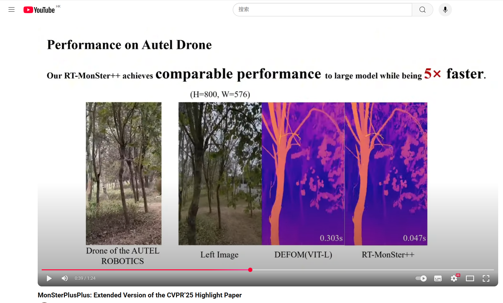

# 🚀 MonSter++ 🚀 
MonSter++: Unified Stereo Matching, Multi-view Stereo, and Real-time Stereo with Monodepth Priors  <a href="https://arxiv.org/abs/2501.08643"></a>

<p align="center">
</p>
<h2>🤗 Demo Video：</h2>
<div align="center">
	<a href="https://www.youtube.com/watch?v=YIhQCuQAKrU">
		
	</a>
</div>
<p></p>

<div align="center">

</div>

## News 
- `[2025/9]` We have open-sourced our lightweight real-time model RT-MonSter++
- `[2025/9]` Weights for RT-MonSter++ model released!
- `[2025/10]` We have open-sourced our accuracy model MonSter++
- `[2025/10]` Weights for MonSter++ model released!

## ✈️ MonSter++ Model weights (accuracy models)

| Model      |                                               Link                                                |
|:----:|:-------------------------------------------------------------------------------------------------:|
| KITTI| [Download 🤗](https://huggingface.co/cjd24/MonSter-plusplus/resolve/main/KITTI_large.pth?download=true) |
| ETH3D | [Download 🤗](https://huggingface.co/cjd24/MonSter-plusplus/resolve/main/ETH3D_large.pth?download=true)|
|Middlebury | [Download 🤗](https://huggingface.co/cjd24/MonSter-plusplus/resolve/main/Middlebury_large.pth?download=true)|
|mix_all | [Download 🤗](https://huggingface.co/cjd24/MonSter-plusplus/resolve/main/Mix_all_large.pth?download=true)|

The mix_all model is trained on all the datasets we collect over 2M image pairs, which has the best performance on zero-shot generalization.

## ✈️ RT-MonSter++ Model weights (light weight models)

| Model      |                                               Link                                                |
|:----:|:-------------------------------------------------------------------------------------------------:|
| KITTI 2012| [Download 🤗](https://huggingface.co/cjd24/MonSter-plusplus/resolve/main/KITTI_2012.pth?download=true) |
| KITTI 2015 | [Download 🤗](https://huggingface.co/cjd24/MonSter-plusplus/resolve/main/KITTI_2015.pth?download=true)|
|mix_all | [Download 🤗](https://huggingface.co/cjd24/MonSter-plusplus/resolve/main/Zero_shot.pth?download=true)|

The mix_all model is trained on all the datasets we collect over 2M image pairs, which has the best performance on zero-shot generalization.

### 🎬 Dependencies

```Shell
pip install torch==2.4.1 torchvision==0.19.1 torchaudio==2.4.1 --index-url https://download.pytorch.org/whl/cu121
pip install tqdm
pip install scipy
pip install opencv-python
pip install scikit-image
pip install tensorboard
pip install matplotlib 
pip install timm==0.6.13
pip install mmcv==2.2.0 -f https://download.openmmlab.com/mmcv/dist/cu121/torch2.4/index.html
pip install accelerate==1.0.1
pip install gradio_imageslider
pip install gradio==4.29.0
pip install "git+https://github.com/facebookresearch/pytorch3d.git"
pip install openexr
pip install pyexr
pip install imath
pip install h5py
pip install swanlab

```

# Leaderboards 🏆
We obtained the 1st place on the world-wide [KITTI 2012 leaderboard](https://www.cvlibs.net/datasets/kitti/eval_stereo_flow.php?benchmark=stereo) and [KITTI 2015 leaderboard](https://www.cvlibs.net/datasets/kitti/eval_scene_flow.php?benchmark=stereo).

1. [KITTI 2012 leaderboard](https://www.cvlibs.net/datasets/kitti/eval_stereo_flow.php?benchmark=stereo)


2. [KITTI 2015 leaderboard](https://www.cvlibs.net/datasets/kitti/eval_scene_flow.php?benchmark=stereo)


 We obtained the 2nd place on the world-wide [ETH3D leaderboard](https://www.eth3d.net/low_res_two_view), while maintaining the lowest inference cost, particularly compared with the top-ranked method.

 3. [ETH3D leaderboard](https://www.eth3d.net/low_res_two_view)
 


## ✈️ Citation

If you find our works useful in your research, please consider citing our papers:

```bibtex

MonSter：
@InProceedings{Cheng_2025_CVPR,
    author    = {Cheng, Junda and Liu, Longliang and Xu, Gangwei and Wang, Xianqi and Zhang, Zhaoxing and Deng, Yong and Zang, Jinliang and Chen, Yurui and Cai, Zhipeng and Yang, Xin},
    title     = {MonSter: Marry Monodepth to Stereo Unleashes Power},
    booktitle = {Proceedings of the IEEE/CVF Conference on Computer Vision and Pattern Recognition (CVPR)},
    month     = {June},
    year      = {2025},
    pages     = {6273-6282}
}

MonSter++：
@article{cheng2025monster,
  title={MonSter: Marry Monodepth to Stereo Unleashes Power},
  author={Cheng, Junda and Liu, Longliang and Xu, Gangwei and Wang, Xianqi and Zhang, Zhaoxing and Deng, Yong and Zang, Jinliang and Chen, Yurui and Cai, Zhipeng and Yang, Xin},
  journal={arXiv preprint arXiv:2501.08643},
  year={2025}
}
```
